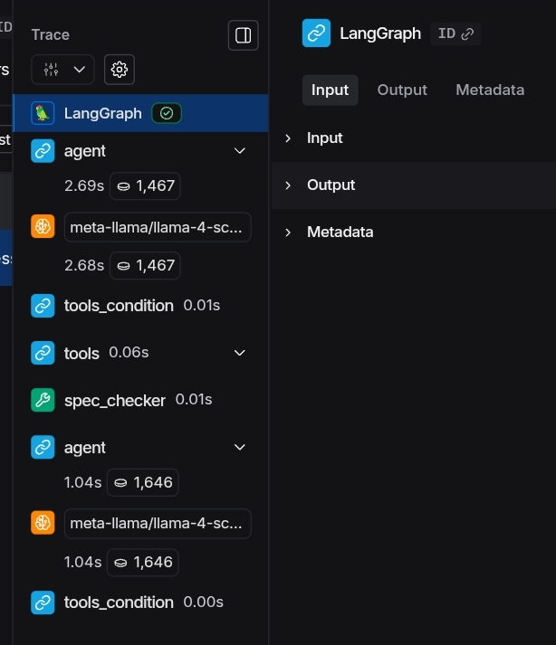

# ⚙️ Industrial AI Copilot

A modular RAG and agentic AI platform for industrial engineering documentation.
Built to demonstrate production-grade LLM system design across four progressive capability phases.

## 🔴 Live Demo

| Interface | URL |
|-----------|-----|
| RAG Search | https://victorisuo-industrial-ai-copilot.hf.space/ui |
| Agent Mode | https://victorisuo-industrial-ai-copilot.hf.space/agent-ui |

---

## What This System Does

Industrial environments generate massive volumes of technical documentation —
equipment manuals, safety datasheets, maintenance guides, compliance standards.

This platform makes that documentation queryable, reasoned over, and actionable
through a progressively capable AI system — from hybrid retrieval to autonomous
multi-agent orchestration.

---

## Architecture Evolution

| Phase | Capability | Status |
|-------|-----------|--------|
| 1 | Hybrid RAG retrieval engine with Cohere reranking | ✅ Complete |
| 2 | LangGraph agentic layer with 4 specialized tools | ✅ Complete |
| 3 | Multimodal extension + MCP integration | 🔨 In Progress |
| 4 | Multi-agent orchestration + evaluation dashboard | 📅 Planned |

---

## Phase 1 — Hybrid RAG Engine

**Problem:** Standard semantic search fails on industrial documentation containing
exact codes, part numbers, and standards (e.g. ISO 9001:2000, NFPA 70E).

**Solution:** Hybrid retrieval combining dense embeddings with BM25 sparse search,
followed by Cohere neural reranking.

```
PDF Loader → Recursive Chunker → ChromaDB + BM25
         → Ensemble Retriever → Cohere Reranker → Groq Llama → Structured Response
```

**Knowledge Base:**
- 21 industrial documents
- 1,109 pages
- 5,091 indexed chunks
- Equipment manuals, safety standards, maintenance guides, safety datasheets

**Key decisions:**
- Chunk size 512, overlap 100 — optimized for precise standard retrieval
- Hybrid weights 0.5/0.5 — balanced semantic and keyword matching
- k=8 retrieval candidates feeding reranker
- Structured Pydantic response with confidence scoring and explicit refusal

---

## Phase 2 — LangGraph Agentic Layer

**Problem:** Complex engineering queries require multi-step reasoning,
not single-shot retrieval.

**Solution:** LangGraph stateful agent with 4 specialized tools that autonomously
plans and executes tool sequences based on query intent.

```
User Query → LangGraph Agent → Tool Selection → Execution → Structured Response
```

**Tools:**
| Tool | Purpose |
|------|---------|
| `search_industrial_documentation` | Hybrid RAG search over knowledge base |
| `spec_checker` | Compare sensor readings against documented specifications |
| `engineering_calculator` | Safe mathematical computation |
| `unit_converter` | Industrial unit conversions (pressure, flow, temperature, power) |

**Example:**

Query: *"Pump pressure reading 450 psi. Spec is 380 psi. Is this dangerous?"*

Agent reasoning:
1. Identifies spec comparison needed
2. Calls `spec_checker` autonomously
3. Computes 18.4% deviation
4. Assesses severity: WARNING
5. Retrieves supporting documentation
6. Generates actionable recommendations with citations

Result: 4 reasoning steps, 1.11 seconds

---

## Tech Stack

| Layer | Technology |
|-------|-----------|
| LLM | Groq — Llama 4 Scout |
| Agent Framework | LangGraph |
| Orchestration | LangChain |
| Vector Store | ChromaDB |
| Embeddings | all-MiniLM-L6-v2 (Sentence Transformers) |
| Retrieval | Hybrid Dense + BM25, Ensemble Fusion |
| Reranking | Cohere rerank-english-v3.0 |
| API | FastAPI |
| Deployment | Hugging Face Spaces (Docker) |

---

## Project Structure

```
industrial-ai-copilot/
├── src/
│   ├── core/          # RAG pipeline, retrieval, reranking, vector store
│   ├── agents/        # LangGraph agent definitions
│   ├── tools/         # Tool abstractions (calculator, spec checker, converter)
│   └── multimodal/    # Phase 3 — image and document processing
├── data/
│   └── raw/           # Source documents (gitignored)
├── static/
│   ├── index.html     # RAG interface
│   └── agent.html     # Agent interface
├── main.py            # FastAPI application
├── Dockerfile
└── requirements.txt
```

---
## Observability

Agent reasoning is fully traced via LangSmith.



Every tool call, latency, token usage, and reasoning step 
is observable and debuggable in production.

## Local Setup

```bash
git clone https://github.com/victorisuo/industrial-ai-copilot.git
cd industrial-ai-copilot
python -m venv venv
venv\Scripts\activate
pip install -r requirements.txt
```

Create `.env` file:
```
GROQ_API_KEY=your_key_here
COHERE_API_KEY=your_key_here
```

Run:
```bash
uvicorn main:app --reload
```

---

## API Endpoints

| Endpoint | Method | Description |
|----------|--------|-------------|
| `/ui` | GET | RAG search interface |
| `/agent-ui` | GET | Agent interface |
| `/query` | POST | RAG query endpoint |
| `/agent` | POST | Agentic reasoning endpoint |
| `/health` | GET | System health check |
| `/docs` | GET | Swagger API documentation |

---

## Roadmap

- [x] Phase 1 — Hybrid RAG with reranking
- [x] Phase 2 — LangGraph agent with tool use
- [ ] Phase 3 — Multimodal (P&ID diagrams, schematics) + MCP server
- [ ] Phase 4 — Multi-agent orchestration + evaluation dashboard

---

## Author

**Victor Isuo** — Applied LLM Engineer

Building RAG and Agentic AI systems for real-world engineering applications.

[GitHub](https://github.com/victor-isuo/industrial-ai-copilot) · [LinkedIn](https://linkedin.com/in/victor-isuo-a02b65171) · [Live Demo](https://victorisuo-industrial-ai-copilot.hf.space/ui)